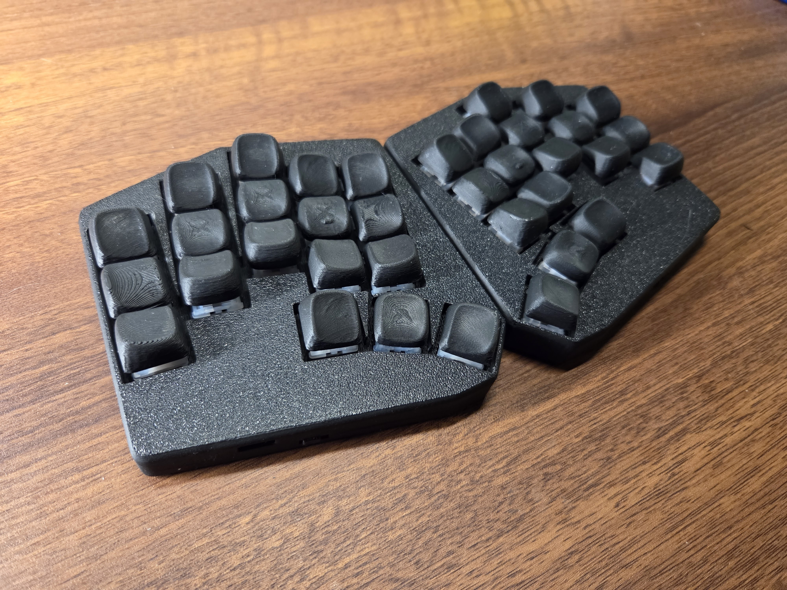
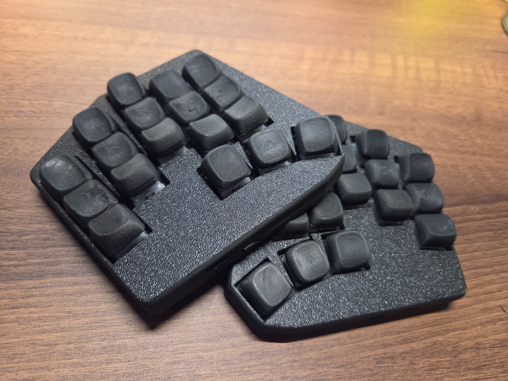
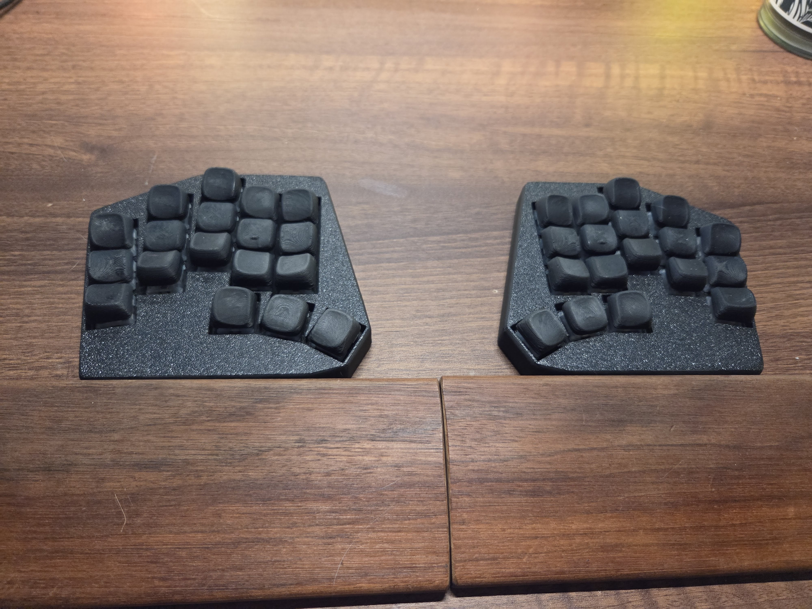

# Hector36
## A sub-100×100 mm split keyboard inspired by Totem, without the extra pinky key



left | right | outline
-|-|-
 |  | 

Hector36 is a 36-key split keyboard with a 5×3 layout and 3 thumb keys per half.  
It is designed to stay under **100 mm × 100 mm per PCB**, which makes fabrication much cheaper while still keeping a comfortable, aggressively staggered and splayed layout.

## Features
- Sub-100×100 mm PCB for low fabrication cost
- Split 36-key layout with 3 thumb keys per half
- Reversible PCB
- Diode-less design
- Programmatically generated with Ergogen
- hotswap sockets

## PCB variants

This repo currently contains several board variants:

| Version | Status | Folder | Buildguide |
|---|---|---|---|
| MX | Tested and working | [`routed_pcb/mx`](routed_pcb/mx) | [guide](routed_pcb/mx/README.md#Build-Guide)
| Choc with choc spacing | Fabricated, not yet received or tested | [`routed_pcb/choc_spacing`](routed_pcb/choc_spacing) | tbd
| Choc with mx spacing | Not routed | `routed_pcb/choc` | tbd
| Gateron low profile with mx spacing | Not routed | `routed_pcb/gateron_lp` | tbd

For PCB fabrication through JLCPCB or PCBWay, use the gerbers.zip file inside the corresponding version folder.

## Components

| Part                           | Qty |      Estimated price | Notes                                                          |
| ------------------------------ | --: | -------------------: | -------------------------------------------------------------- |
| PCB                            |   2 |          $3.50 for 5 |                                                                |
| nice!nano or nRF52840          |   2 | $4 each for nRF52840 |  I'm using nRF52840 for cheaper cost |
| Reset switch                   |   2 |        $3.40 for 100 | 3×6×2.5 mm, 2-pin, SMD push button                             |
| Power switch                   |   2 |           $4 for 100 | 7-pin, MSK 12C02                                               |
| Battery                        |   2 |            $15 for 2 | 301230, 3.7 V Li-Po                                            |
| 2P ST PH2.0 right-angle socket |   2 |           $2 for 100 | Optional                                                       |
| Hotswap socket                 |  36 |           $10 for 70 |     also depends on socket type    |
| Switch                         |  36 |                    — |                                                                |
| Keycap                         |  36 |                    — | Some keycaps may need rotated orientation for the Choc version. |
| M3 heat-set insert             |   8 |            $3 for 50 |                                                                |
| M3 screw                       |   8 |            $3 for 50 |                                                                |
| Rubber feet                    |   8 |            $5 for 50 |                                                                |

note that estimated price is from a brief look at aliexpress, and might be higher than what you'll actually have to pay if you buy in higher quantities (especially for batteries)

## Inspiration

- [bgkeeb](https://github.com/sadekbaroudi/bgkeeb)
  - keyboard pcbs under 100mm x 100mm are cheap
- [cheapis](https://github.com/dotleon/cheapis) 
  - sweeps can be rotated for more room and length between the thumb cluster and rest of the keys and still fit within 100mm x 100mm
- [samoklava](https://github.com/soundmonster/samoklava) and [ergogen](https://ergogen.cache.works/) to get keyboard layouts programatically 
- [sweep](https://github.com/davidphilipbarr/Sweep) and [swweeep](https://github.com/sadekbaroudi/sweep36) for form factor and diode-less design
- [totem](https://github.com/GEIGEIGEIST/totem) and [KLOR](https://github.com/GEIGEIGEIST/KLOR)
  - keys layout
  - sandwich case looks really slick and clean, and can also hide the controller parts that will be located under the palm

## Other considerations
- this design does not support LEDs or displays
- [samoklava's](https://github.com/soundmonster/samoklava) auto routing does not really work here
- some keycaps might need to be rotated 90 degrees

## Rendering and generation

### Ergogen:
```bash
ergogen .
```
### Case:
printables: https://www.printables.com/model/1659997-case-for-hector36

onshape [link](https://cad.onshape.com/documents/dab7ead69061981322a5fa82/w/eeec2b07408bf6c3576b55db/e/49101eb28d1b1828dfaa91ca?renderMode=0&uiState=69ce0391edbfc1314134fd9e)

### Get board image renderings:
```bash
export pcb_type="mx"

docker run -v $(pwd):/kikit --entrypoint pcbdraw yaqwsx/kikit:v1.3.0-v7  plot --style style.json routed_pcb/$pcb_type/board.kicad_pcb routed_pcb/$pcb_type/images/board-front.png

docker run -v $(pwd):/kikit --entrypoint pcbdraw yaqwsx/kikit:v1.3.0-v7  plot --style style.json --side back routed_pcb/$pcb_type/board.kicad_pcb routed_pcb/$pcb_type/images/board-back.png
```

## Showcase





